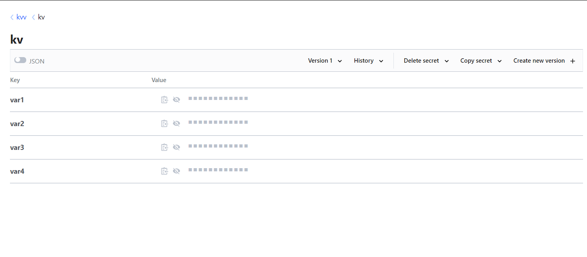
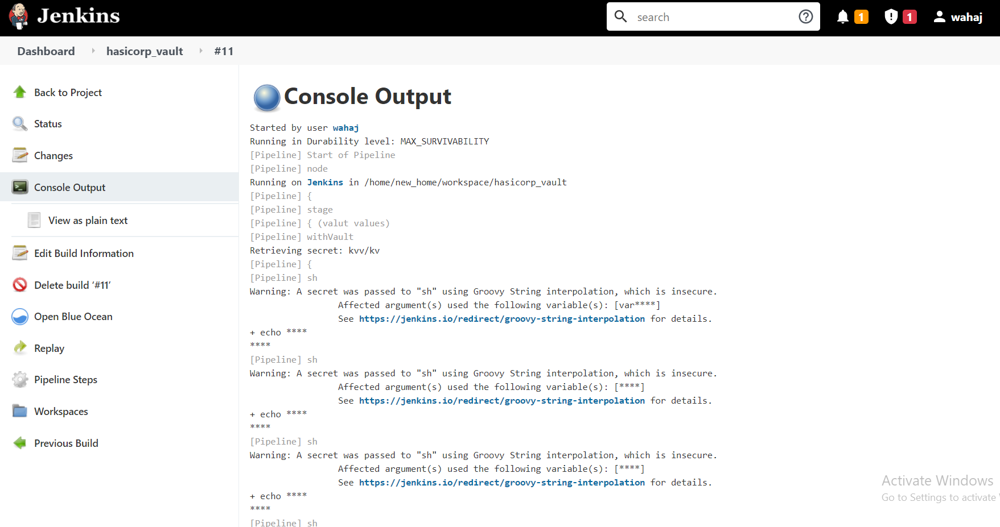
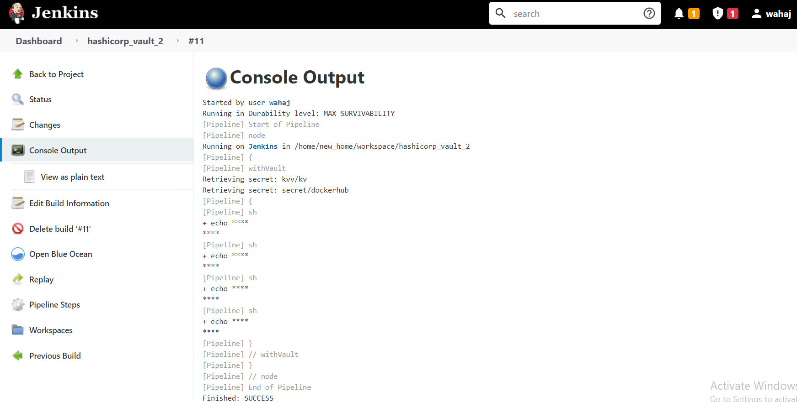

# Jenkins with hashicorp plugin

### Pre-reuistes:
1. Hashicorp vault

2. Jenkins server
    - Install Hashicorp plugin
    - Configure the plugin
        1. Go to configure systems
        2. Add vault url and credentials for it
3. Call the plugin settings in the pipeline

Jenkins pipeline to fetch the secrets from Hashicorp vault from a single path:
```
node{
    stage('valut values'){
        withVault(configuration: [timeout: 60, vaultCredentialId: 'vault-token', vaultUrl: 'http://3.15.225.210:8200'], vaultSecrets: [[path: 'kvv/kv', secretValues: [[vaultKey: 'var1'], [vaultKey: 'var2'], [vaultKey: 'var3'], [vaultKey: 'var4']]]]) {
            sh "echo '$var1'"
            sh "echo '$var2'"
            sh "echo '$var3'"
            sh "echo '$var4'"
        }
    }
}
```


This is the code snippet if you want to configure 2 paths and fetch it values
```
node {
    // define the secrets and the env variables
    // engine version can be defined on secret, job, folder or global.
    // the default is engine version 2 unless otherwise specified globally.
    def secrets = [
        [path: 'kvv/kv', engineVersion: 2, secretValues: [
            [vaultKey: 'var1'], [vaultKey: 'var2'], [vaultKey: 'var3'], [vaultKey: 'var4']]],
        [path: 'secret/dockerhub', engineVersion: 2, secretValues: [
            [vaultKey: 'password'], [vaultKey: 'username']]]
    ]

    // optional configuration, if you do not provide this the next higher configuration
    // (e.g. folder or global) will be used
    def configuration = [vaultUrl: 'http://3.15.225.210:8200',
                         vaultCredentialId: 'vault-token',
                         engineVersion: 1]
    // inside this block your credentials will be available as env variables
    withVault([configuration: configuration, vaultSecrets: secrets]) {
        sh 'echo $var1'
        sh 'echo $password'
        sh 'echo $var2'
        sh 'echo $username'
    }
}

```


### Credential method
1. For this method we need to install the vault in Jenkin's server using simple command:
    - Linux
        ```
        wget https://releases.hashicorp.com/vault/1.2.3/vault_1.2.3_linux_amd64.zip
        unzip vault_1.2.3_linux_amd64.zip
        mv vault /usr/bin
        vault
        ```
    - Mac
        `brew install vault`
```
import groovy.json.JsonSlurper
node {
    // Add the path to your secrets
    def kv_path = 'kv/secret'
    withCredentials([[$class: 'VaultTokenCredentialBinding', 
                      addrVariable: 'VAULT_ADDR', // no need to change
                      credentialsId: 'vault-token', // Add your credential id 
                      tokenVariable: 'VAULT_TOKEN', // no need to change
                      vaultAddr: 'http://127.0.0.0:8200']]) { // Add your vault URL
        script{
            secret_key = sh (
                        script: "vault kv get -format json -field=data $kv_path", 
                        returnStdout: true
                        ) // This will list the secrets in the defined path and store it in secret_key
            // Parse the response
            def list = new JsonSlurper().parseText( secret_key )
            // Print them out to make sure
            list.each { println it }
        }
    }
}
```
1. Update the `kv_path` variable
2. Add your credentialId
3. Update the vaultAddr